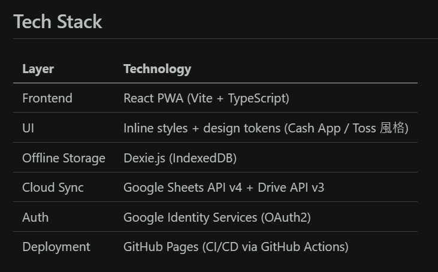
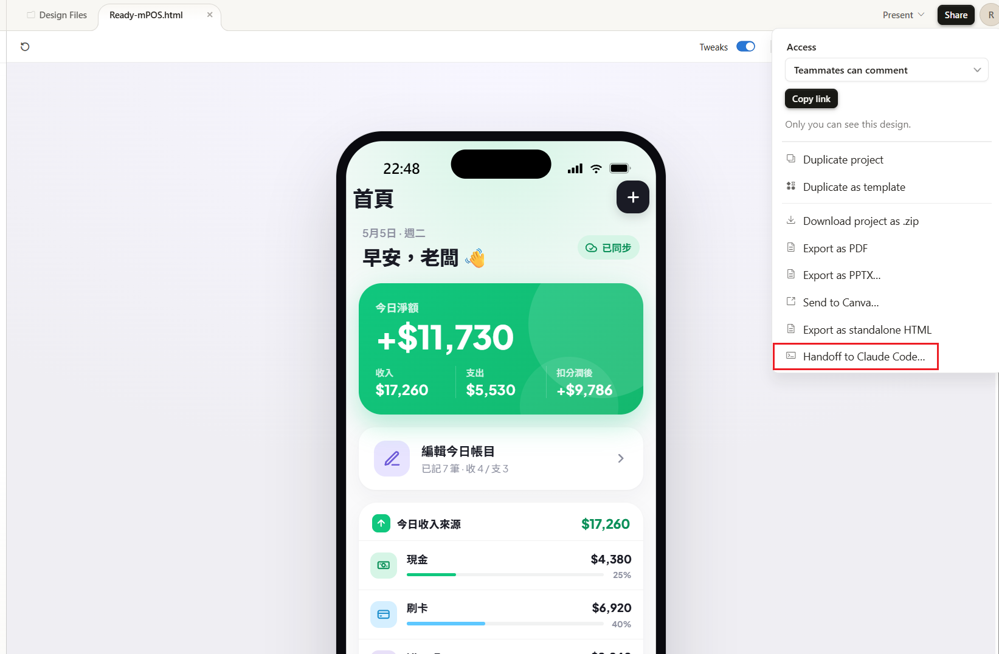
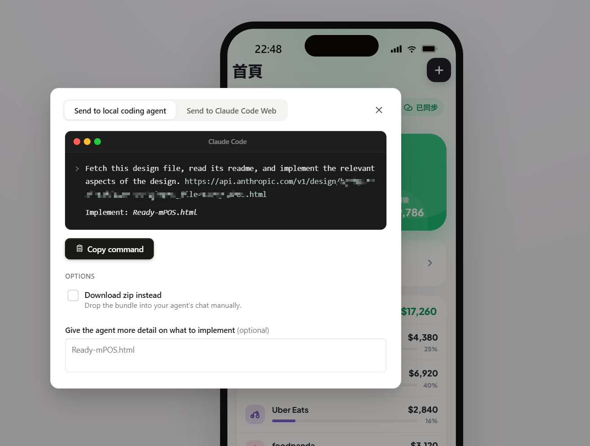
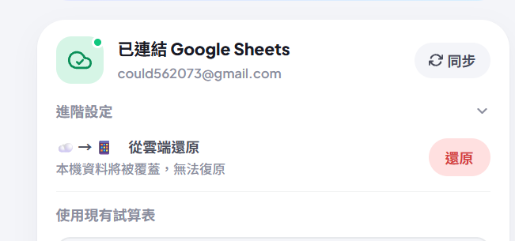

+++
title = "Claude Code 實作筆記(二)"
date = 2026-05-05
draft = false
tags = ["AI"]
categories = ["AI","Claude"]
+++

Claude Code 實作筆記(二)
===

## 目標:第二版本實現
第二天的目標就是把Claude design的第二版本實現出來

然後經由第一天初體驗，把一些非必要的實作邏輯省略，重新梳理了一個版本

(簡化了許多東西)

其實第一天就是讓AI自由發揮，也順便看他可以做到什麼程度，結果前後端代碼一下就完成了...

## 刻畫面

其實請AI按照原形刻畫面真的是超快，如果你的原型細節足夠多，大概就是半小時之內的事情，當然實際功能是還沒實現，只是先讓AI去對照原型實現

(claude design可以直接send連結給claude code cli，算是挺方便)

## 同步google sheet

今天想說先把最重要的google同步功能完成，本來想說也是咻咻完成，但其實同步這件事情要考量的點非常的多

單單是不同裝置之間，或是本地離線數據與雲端之間的數據衝突，基本就有很多細節要考量進去，雖然說以前就做過類似的實現，也是網站同步到google sheet當作資料庫用，但卻發現，其實同步這件事完成很容易

但是自己測試的時候就發現很多場景其實AI是不會主動幫你想好

像是離線數據跟雲端數據衝突，要以哪邊為主，如果兩支手機都有本地資料，那跟雲端數據誰先誰後，其實不少坑要考慮阿XD

然後就以為AI都會幫我想好所以就沒考慮這一塊，然後就來來回回的討論跟修改，最後才決定就是只要登入後會單向同步，跟 可以手動觸發從雲端同步回手機

最後也是有完成目標，但是跟AI來回討論耗費很多精力，也有可能是因為我的 model 並不是選最厲害的 model，但為了省token只能犧牲我的大腦了，人機合一是這樣用的嗎xd