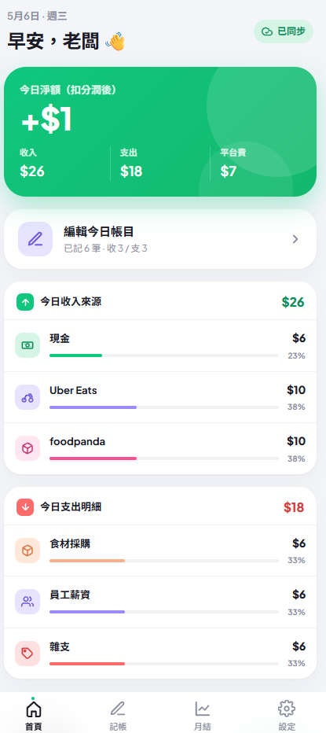
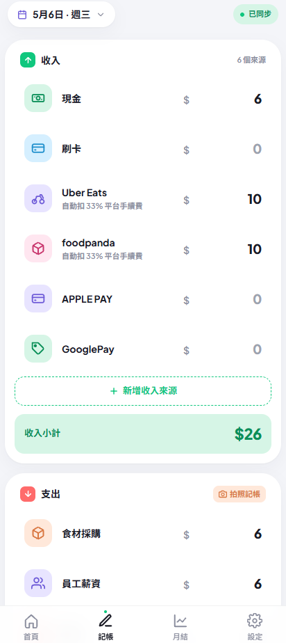
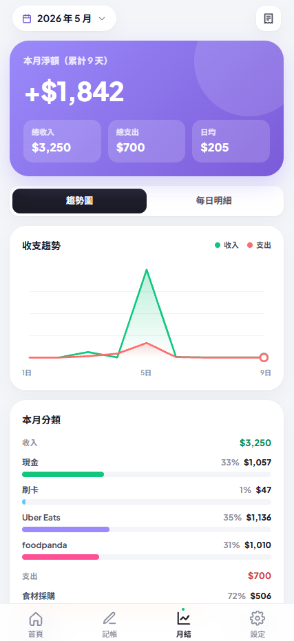
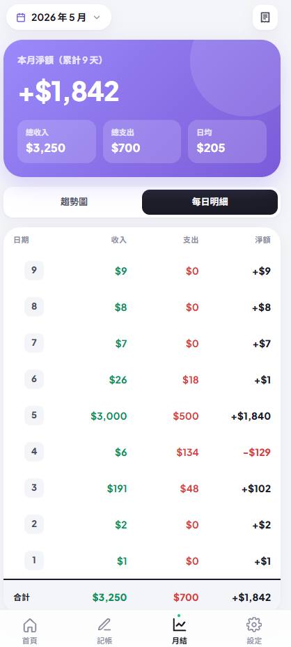
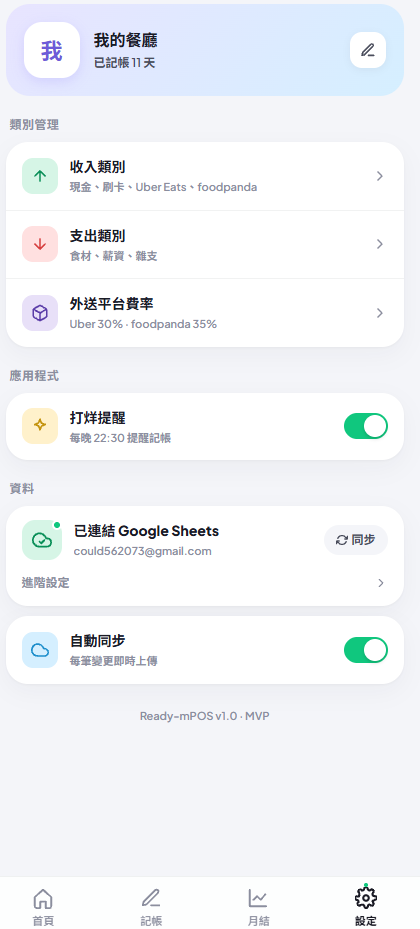

+++
title = "Claude Code 實作筆記(三)"
date = 2026-05-05
draft = false
tags = ["AI"]
categories = ["AI","Claude"]
+++

Claude Code 實作筆記(三)
===

第三版，就是瘋狂的DEBUG跟移除不必要的功能，優化使用者體驗，和一些小功能移除跟整理

基本算最終定案版本，之後就會拿去給女朋友媽媽實際使用看看，如果還有新的feature再來動，不然基本就到這xd

## 耗時:
實際工時應該是一天大概2~3個小時(Claude code Usage限制了開發的速度阿)，所以粗略估計實際

Day: 4
Actual Hour: 2~3 * 4 = 8~12 HR
Design: 30 min (?

## 首頁

## 記帳頁面

## 月結

## 月結每日明細

## 配置頁面

