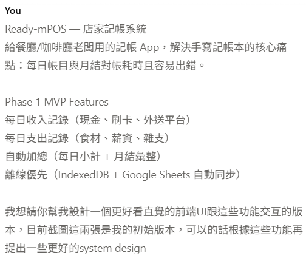

+++
title = "Claude Code 實作筆記(三)"
date = 2026-05-05
draft = false
tags = ["AI"]
categories = ["AI"]
+++

Claude Code 實作筆記(三)
===

主要在開發資料類別管理，這個牽扯到動態增減類別還要考慮月結跟首頁的顯示，算是一個大工程，但只要在規劃期間有說明清楚和考慮的點，如googles sheets怎麼設計，類別儲存怎麼對應，這算是最大的功能改動

最後設計完成就是瘋狂的DEBUG跟移除不必要的功能，優化使用者體驗，和一些小功能移除跟整理

目前即最終版定案

## 工時:

#### 天數: 四天

#### 實際開發工時: 8~15 HR 

#### 設計: 0.5 HR

## Claude code 代理開發心得
AI開發時間真的是飛快且沒有什麼大問題 (相較於半年前大概是容易出錯的等級，好可怕)

大部分時間都是在review AI產出的功能，只要功能方向很明確，基本上實現都沒問題，但如果實現的邏輯不夠清晰，就會導致AI產出與你要的不同而來回修改(可能我用sonnet4.6開發的關係?)

## Claude Design 使用心得

很誇張，非常強的等級，具體產出不到10分鐘已經做出一個完整，美化，可互動的UI，且可以直接send給claude code做讀取，不需要再額外去做任何提示字，而且在你提出你的需求之後，他還會先做一次細節討論跟風格設計方向，真的有點強

下面是我當初提供的資料

提示字部分

初版UI

## 成果展示
完成的專案我已經佈署上gitHubPage供參考試用，如果需要的人可以直接拿去配

https://could562073.github.io/Ready-mPOS/