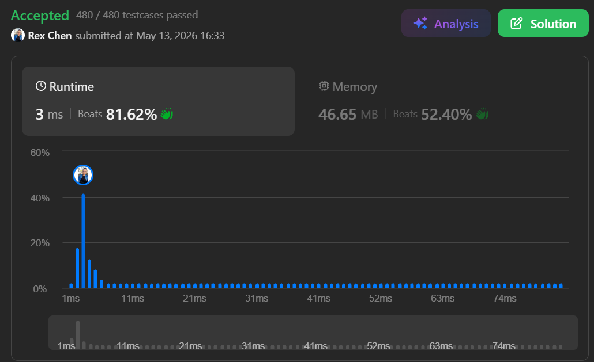

+++
title = "345. Reverse Vowels of a String"
date = 2026-05-12
draft = false
tags = ["LeetCode", "easy"]
categories = ["LeetCode"]
+++

# 345. Reverse Vowels of a String

## 主要用了什麼方法：
two pointers

## 用了多久: 


## 卡在哪裡：
嘗試超過兩個小時一直想使用for攻略這種題目，再嘗試一遍還是失敗
用了錯誤的方式處理此問題，知道是雙向跑Index移動，但是因為對於這類型沒有概念

## Time Complexity:  
**O(n)**

#### 【推論邏輯】
3 n

## Space Complexity:  
**O(n)**

#### 【推論邏輯】
char[] charArray 轉成隨input增減的空間 -> n

## My Solution:

```java
class Solution {
    public static String reverseVowels(String s) {
        char[] charArray = s.toCharArray();
        String vowels = "aeiouAEIOU";
        int left = 0;
        int right = s.length() - 1;
        while (left < right) {
            while (left < right && vowels.indexOf(charArray[left]) == -1) {
                left++;
            }
            while (left < right && vowels.indexOf(charArray[right]) == -1) {
                right--;
            }
            if (left < right) {
                char temp = charArray[left];
                charArray[left] = charArray[right];
                charArray[right] = temp;

                left++;
                right--;
            }
        }
        return String.valueOf(charArray);
    }
}
```

### 學到什麼：

two pointers的固定寫法，通常雙指針會一起移動，所以用iterator左右一起移動最好

反思:不該硬要追求使用特定寫法解題，應理解正確解法的底層原因

## accepted


## 最佳解

```java
class Solution {
    public String reverseVowels(String s) {
        boolean[] v = new boolean[128];
        for (char c : "aeiouAEIOU".toCharArray()) v[c] = true;

        char[] arr = s.toCharArray();
        int l = 0, r = arr.length - 1;

        while (l < r) {
            while (l < r && !v[arr[l]]) l++;
            while (l < r && !v[arr[r]]) r--;

            char tmp = arr[l];
            arr[l] = arr[r];
            arr[r] = tmp;

            l++; r--;
        }

        return new String(arr);
    }
}
```

### 最佳解心得

這是一個非常精妙且具備「底層思維」的優化手法，也是在頂尖面試（如 FAANG）中展現效能優化意識的加分項。

### 為什麼 `boolean[128]` 可以判斷母音？

這背後的原理是利用 **ASCII 編碼**。

在電腦底層，每一個字元（`char`）其實都對應一個整數編碼（ASCII）。例如：

* `'A'` 的編碼是 **65**
* `'a'` 的編碼是 **97**
* 標準 ASCII 表的範圍是 **0 到 127**。

當你宣告 `boolean[128]` 時，你其實是建立了一個長度為 128 的布林陣列。

#### 運作邏輯拆解：

1. **陣列索引即是編碼**：當你寫 `v[c] = true` 時，Java 會自動將字元 `c` 轉為整數。例如，如果 `c` 是 `'a'`，這行程式碼等同於執行 `v[97] = true`。
2. **空間換時間**：你預先在這些特定位置標記為 `true`。
3. **$O(1)$ 查找**：判斷 `!v[arr[l]]` 時，電腦只需要直接去記憶體位址為 `97` 的地方看一眼，不需要像 `String.indexOf()` 那樣跑遍整個母音字串。

---

### 與其他判斷方式的效能對比

身為開發者，我們可以從「時間複雜度」的角度來分析為什麼這招更強：

| 方法 | 邏輯 | 效能等級 | 說明 |
| --- | --- | --- | --- |
| **String.indexOf()** | `vowels.indexOf(c)` | $O(k)$ | 每次都要在 `aeiouAEIOU` 這 10 個字裡搜尋一遍。 |
| **HashSet.contains()** | `set.contains(c)` | $O(1)$ | 理論上很快，但有 Hash 計算與物件封裝的開銷。 |
| **boolean[128]** | `v[c]` | **極致 $O(1)$** | **最快**。直接位址偏移查找，沒有任何計算與物件負擔。 |

---

### 為什麼這在面試中是「專業表現」？

1. **對資料類型的理解**：你展現了知道 `char` 在底層是整數（primitive type）的特性。
2. **效能敏感度**：在處理數百萬次查詢時，陣列索引查找的 CPU 指令週期（Clock Cycles）遠少於呼叫方法或雜湊運算。
3. **環境預判**：你知道題目給的是標準英文字元（ASCII 範圍內），所以 128 的空間就足夠了。

### 小細節提醒

如果題目今天說輸入包含 **Unicode（如中文、特殊符號）**，那麼 `boolean[128]` 就會發生 `ArrayIndexOutOfBoundsException`。但在 LeetCode 的字串類題目中，通常明確指出是英文字母，所以這是一個非常推薦的「黑科技」寫法。