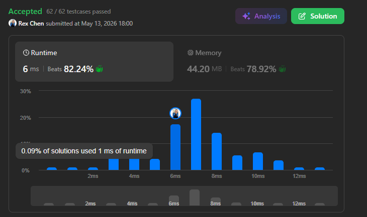

+++
title = "151. Reverse Words in a String"
date = 2026-05-13
draft = false
tags = ["LeetCode"、"meduim"]
categories = ["LeetCode"]
+++

# 151. Reverse Words in a String

## 主要用了什麼方法：
* ver1: for loop 搭配 StringBuilder String.split(' '); 等等
* ver2: while 跟 charArray 對一個位置進行操作，速度快上不少

## 用了多久: 
* ver1: ~38min
* ver2: >45min

## 卡在哪裡：
ver2: 主要還是在雙指針移動的位置上思考很久，最後還是需要參考別人答案和ai的解法來進行最後的提交，但是基本概念以理解，在指針位置操作上需要許多步驟，很容易會忘記自己在做什麼，可能需要做一些pseudo code幫助自己理解整個步驟

## Time Complexity:  
**O(n)**

#### 【推論邏輯】

多層迴圈不代表就是 O(n³)，關鍵要看**每個字元總共被碰幾次**。

逐步分析：

**第一步 reverse 全部：** 每個字元碰一次 → O(n)

**外層 while 迴圈：** 看起來有三層，但其實 `start` 是單調遞增的，從 0 走到 end 只走一次，不會重複。

```
start: 0 → 1 → 2 → 3 → ... → n
       ↑跳空格  ↑複製字元
       這兩個 while 共用同一個 start，加起來走 n 步，不是 n × n
```

**每個單字的 reverse：** 所有單字長度加起來 = n，所以總共也是 O(n)

三個步驟都是 O(n)，加起來還是 **O(n)**。

---

### 為什麼容易誤判成 O(n³)？

```java
while (start < end) {                          // 看起來 O(n)
    while (start < end && charArray[start] == ' ')  // 看起來 O(n)
    while (start < end && charArray[start] != ' ')  // 看起來 O(n)
}
```

直覺上 n × n × n，但這是錯的。正確思考方式是：

> `start` 在整個過程中只從 0 移動到 n，**三個迴圈共用同一個 start**，所以總步數是 n，不是 n³。

## Space Complexity:  
**O(n)**

#### 【推論邏輯】

```java
char[] charArray = s.toCharArray();  // 複製整個字串 → O(n)
```

額外用了一個長度 n 的 array，所以是 O(n)。

如果題目允許 in-place 修改原字串（像 C++ 的 `string`），空間可以壓到 O(1)，但 Java 的 `String` 是 immutable，所以 O(n) 是**這個語言下的最佳解**。

## My Solution ver 2:
```java
public String reverseWords(String s) {
        char[] charArray = s.toCharArray();
        int start = 0;
        int end = s.length();
        //reverse all
        reverse(charArray, start, end-1);

        //reverse words
        int writeIndex = 0;
        while (start < end) {
            while (start < end && charArray[start] == ' ') {
                start++;
            }
            if (start < end) {
                int wordStart = writeIndex;

                while (start < end && charArray[start] != ' ') {
                    charArray[writeIndex] = charArray[start];
                    writeIndex++;
                    start++;
                }
                reverse(charArray, wordStart, writeIndex - 1);

                if (start < end) {
                    charArray[writeIndex] = ' ';
                    writeIndex++;
                }
            }
        }

        int finalLength = (writeIndex > 0 && charArray[writeIndex - 1] == ' ') 
                          ? writeIndex - 1 
                          : writeIndex;
        return new String(charArray, 0, finalLength);
    }

    public void reverse(char[] charArray, int start, int end) {
        while (start < end) {
            if (start < end) {
                char temp = charArray[start];
                charArray[start] = charArray[end];
                charArray[end] = temp;
                start++;
                end--;
            }
        }
    }
```

### 學到什麼：
two pointers在同一個array移動時很容易迷失方向，要很清楚整個邏輯推導方向避免許多錯誤

#### 反思: 
two pointers的使用變化，移動邏輯複雜時並不好理解，需要理解清楚其中規律跟原理，array的邊界處理也是非常重要的一環

#### 第一次提交的版本反思:
主要是用了java提供的一些util來做實現，所以寫法上看起來簡潔但比起直接操作char進行移動，這些方式還是需要耗費不小的運算資源

## accepted ver2


## My Solution ver 1:

```java
class Solution {
    public String reverseWords(String s) {
        if(s.length() <= 1) return s.trim();
        String[] strArray = s.trim().split("\\s+");
        StringBuilder sb = new StringBuilder();
        for (int i = strArray.length - 1; i >= 0; i--) {
            sb.append(strArray[i]);
            if (i > 0) {
                sb.append(" ");
            }
        }
        return sb.toString();
    }
}
```

### Accepted  ver1

