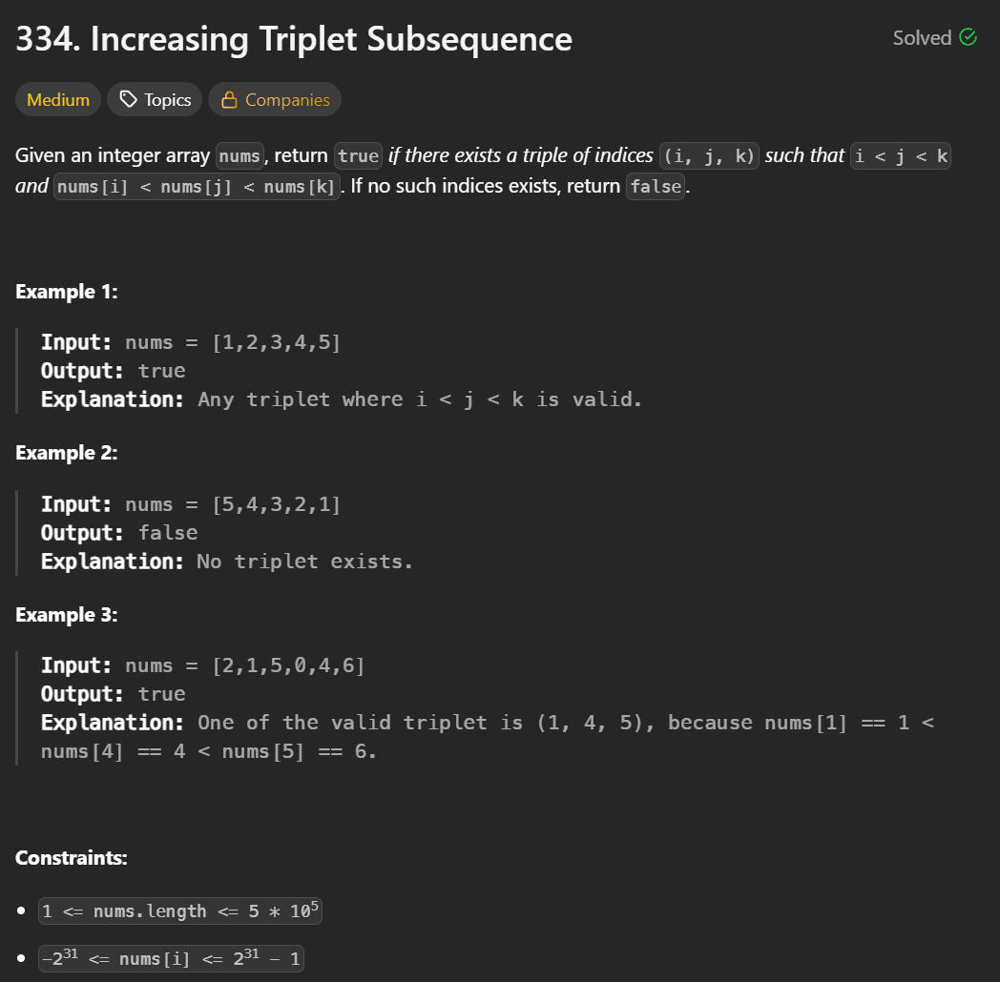

+++
title = "334. Increasing Triplet Subsequence"
date = 2026-05-15
draft = false
tags = ["LeetCode", "meduim"]
categories = ["LeetCode"]
+++



## 主要用了什麼方法：
for loop

## 用了多久: 
38min

## 卡在哪裡：
某個test case過不去，發現有BUG，後來參考別人做法，大致邏輯相符，if我多做了一些不必要的判斷

## Time Complexity:  
O(n)

## Space Complexity:  
O(1)

## My Solution:

```java
class Solution {
    public boolean increasingTriplet(int[] nums) {
        int i=Integer.MAX_VALUE,j=Integer.MAX_VALUE;
        for(int m=0; m<nums.length; m++){
            if(nums[m] < i){
                i = nums[m];
            }
            if(i < nums[m] && nums[m] < j){
                j = nums[m];
            }
            if(i< j && j < nums[m]){
                return true;
            }
        }
        return false;
    }
}
```

### 學到什麼：
題目在問什麼很重要，必須快速理解到題目想問的重點，才能推導出實際的演算法
