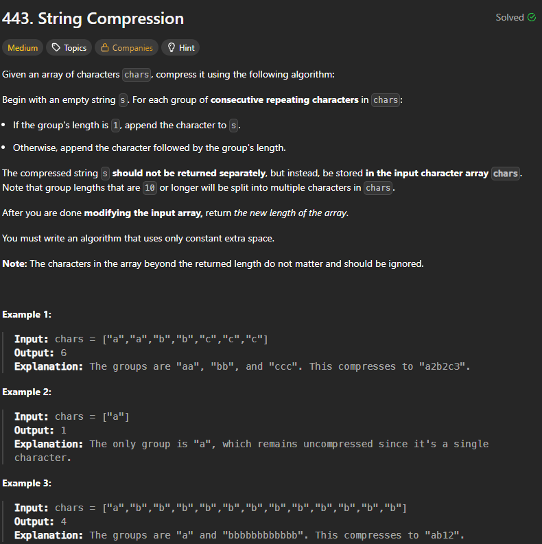

+++
title = "443. String Compression"
date = 2026-05-15
draft = false
tags = ["LeetCode", "meduim"]
categories = ["LeetCode"]
+++



## 主要用了什麼方法：
while
## 用了多久: 
>45min

## 卡在哪裡：
腦袋卡住，這題不難，只是要搞清楚程式怎麼堆疊數字

## Time Complexity:  
O(n)

## Space Complexity:  
O(1)

## My Solution:

```java
 public int compress(char[] chars) {
        int index = 0;
        int i = 0;
        int n = chars.length;
        while (i < n) {
            char current_char = chars[i];
            int count = 0;
            while (i < n && chars[i] == current_char) {
                i++;
                count++;
            }
            chars[index] = current_char;
            index++;
            if (count > 1) {
                String count_str = String.valueOf(count);
                for (char c : count_str.toCharArray()) {
                    chars[index] = c;
                    index++;
                }
            }
        }
        return index;
    }
```

### 學到什麼：
整數10位數的轉法，直接轉charArray就會隔開
int 10 = char ['1','0']
指針控制對於java其實很少使用，幾乎沒有熟練度，在leetCode的題目才開始看到此類型寫法

## Accepted

