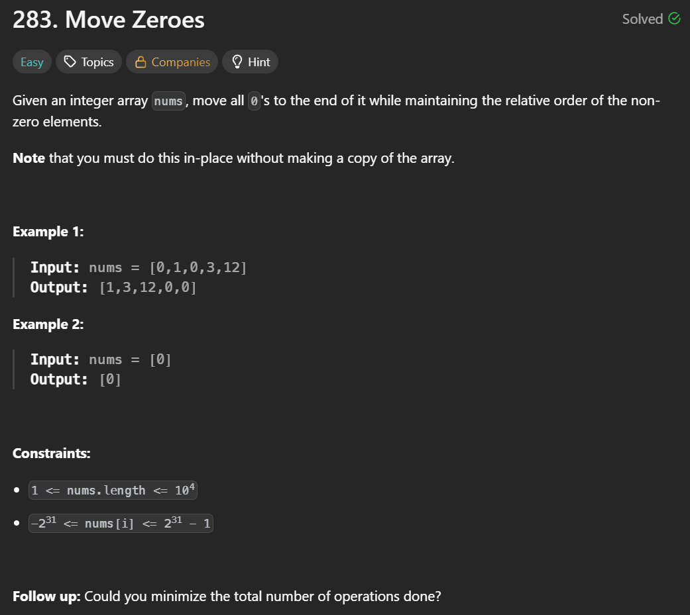
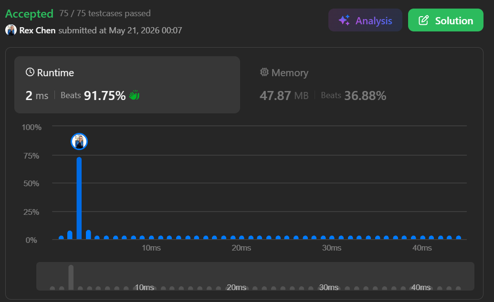

+++
title = "283. Move Zeroes"
date = 2026-05-21
draft = false
tags = ["LeetCode", "easy"]
categories = ["LeetCode"]
+++



## 主要用了什麼方法：
while
## 用了多久: 
>45min

## 卡在哪裡：
腦袋卡住，指針用法不夠熟練

## Time Complexity:  
O(n)

## Space Complexity:  
O(1)

## My Solution:

```java
class Solution {
    public void moveZeroes(int[] nums) {
        int i = 0;
        int n = nums.length;
        int j = 0;
        while (i < n) {
            if (nums[i] != 0) {
                int temp = nums[i];
                nums[i] = nums[j];
                nums[j] = temp;
                j++;
            }
            i++;
        }
    }
}
```

### 學到什麼：
指針需要多練習

## Accepted
