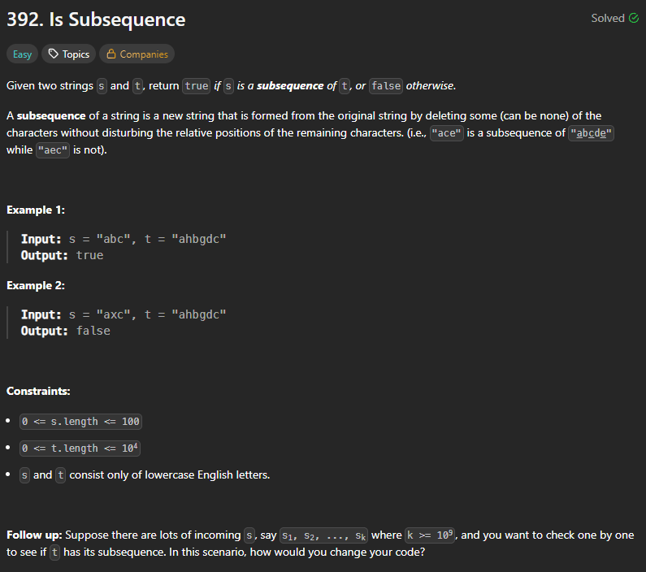

+++
title = "392. Is Subsequence"
date = 2026-05-22
draft = false
tags = ["LeetCode", "easy"]
categories = ["LeetCode"]
+++

# 392. Is Subsequence



## 主要用了什麼方法：
指針移動 while

## 用了多久: 
15 min

## 卡在哪裡：
指針題型已經逐漸熟練，這次沒卡，不過邊界忘了處理，後來補上才過
且常常有基礎語法錯誤，還是要盡量避免run的時候一直出現語法錯誤

## Time Complexity:  
**O(n)**

## Space Complexity:  
**O(n)**

## My Solution:
```java
class Solution {
    public boolean isSubsequence(String s, String t) {
        if(s.length() < 1) return true;
        if(s.length() >= 1 && t.length() < 1) return false;
        int i = 0;
        int sCount = 0;
        char[] sc = s.toCharArray();
        char[] st = t.toCharArray();
        while(i < t.length()){
            if(st[i] == sc[sCount]){
                sCount++;
                if(sCount == s.length()){
                    return true;
                }
            }
            i++;
        }
        return false;
    }
}
```

### 學到什麼：
1. 邊界處理
2. 基礎語法error需要盡量避免

## Accepted


## ai recommand solution

String有一個charAt()方法，用這個可以省兩個記憶體空間
(果然把java基礎都忘光光了哇哈哈!)

time: O(n), space: o(1)

```java
class Solution {
    public boolean isSubsequence(String s, String t) {
        // 邊界條件處理
        if (s.length() == 0) return true;
        if (t.length() == 0) return false;
        
        int sPointer = 0;
        int tPointer = 0;
        
        // 用一個簡單的 loop 走訪 t
        while (tPointer < t.length()) {
            // 如果字元匹配成功，s 的指標往後移
            if (t.charAt(tPointer) == s.charAt(sPointer)) {
                sPointer++;
                // 如果 s 的指標已經走完 s 的長度，代表全部找到了
                if (sPointer == s.length()) {
                    return true;
                }
            }
            tPointer++;
        }
        return false;
    }
}
```