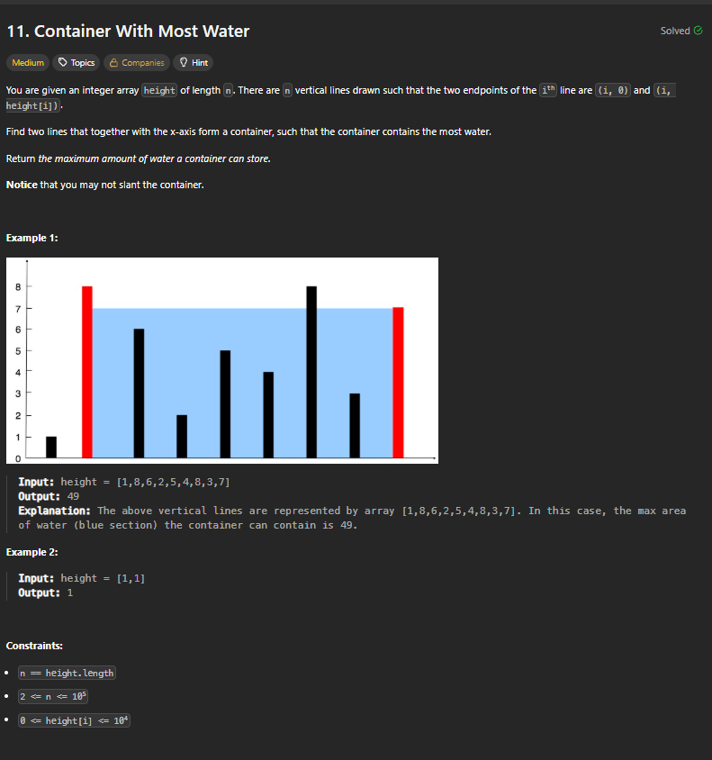
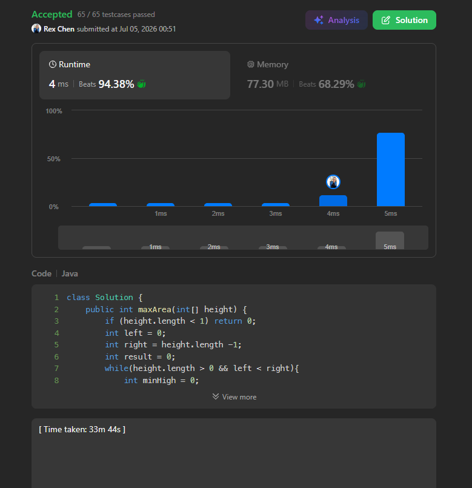

+++
title = "11. Container With Most Water"
date = 2026-07-05
draft = false
tags = ["LeetCode", "meduim"]
categories = ["LeetCode"]
+++

# 11. Container With Most Water



## 主要用了什麼方法：
指針移動 while

## 用了多久: 
30 min+

## 卡在哪裡：
題目的理解深度不夠，其中一個test case卡住，後來用GPT協助釐清我的邏輯誤點，本來使用四個指針紀錄位置，但實際上只需要兩個指針紀錄即可，在題目理解深度不足導致錯誤，後來修正後完成答案

## Time Complexity:  
**O(n)**

## Space Complexity:  
**O(1)**

## My Solution:
```java
class Solution {
    public int maxArea(int[] height) {
        int left = 0;
        int right = height.length -1;
        int result = 0;
        while(left < right){
            int minHigh = 0;
            if(height[left] < height[right]){
                minHigh = height[left];
            } else {
                minHigh = height[right];
            }
            int length = right - left;
            if(minHigh * length > result){
                result = minHigh * length;
            }

            if(height[left] < height[right]){
                left++;
            } else {
                right--;
            }
        }
        return result;
    }
}
```

### 學到什麼：
1. 題目的理解深度不夠

## Accepted

